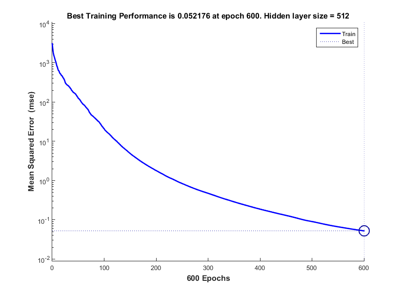
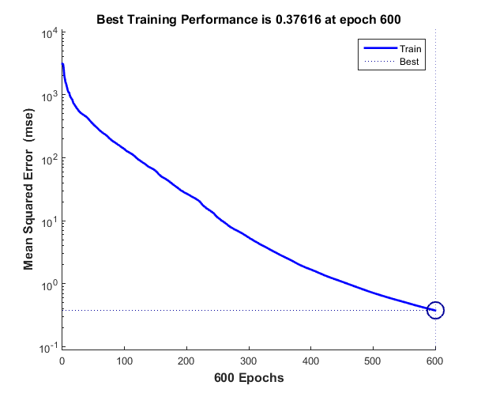
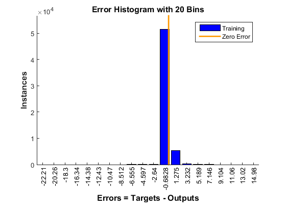
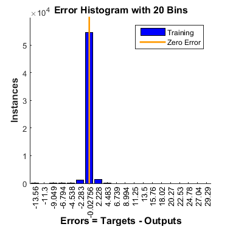
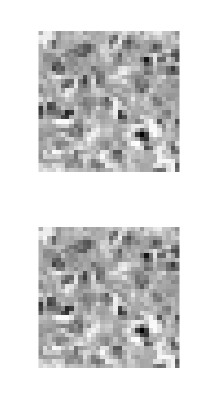

# SYDE 522 Assignment 2
## Autoencoding Histo-pathology images
The images were downloaded from learn and loaded into MATLAB. They were then converted into 32x32 grayscale images. Since all these operations were done in MATLAB 2015a, which did not have a default implementation of the autoencoder class, a feedforwardnet was created and configured with a single hidden layer of varying sizes starting at 1024/2, where 1024 = 32x32.
### Autoencoder with varying hidden layer sizes
The performance(MSE) of this autoencoder is shown in the plot below:

The plot below shows how the error histogram for this network. As is visible in the histograms, most of the errors happened very close to zero.

The outputs were then predicted using the trained network. A comparision between the original image and the image predicted by the network is shown below:. The first set of 2 images compares the results for hidden layer size of 512 while the second set of 2 images is for a hidden layer size of 256. The values of the MSE have increased when the size of the hidden layer was decreased.

