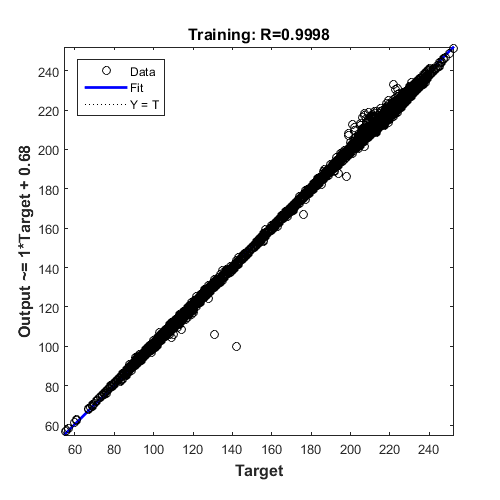
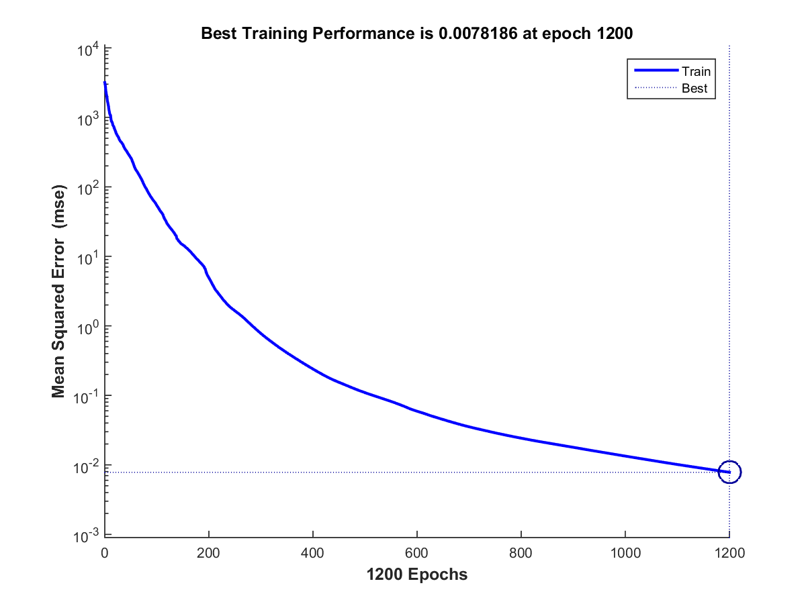
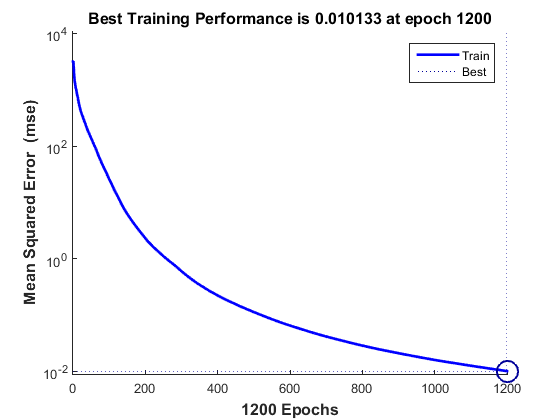
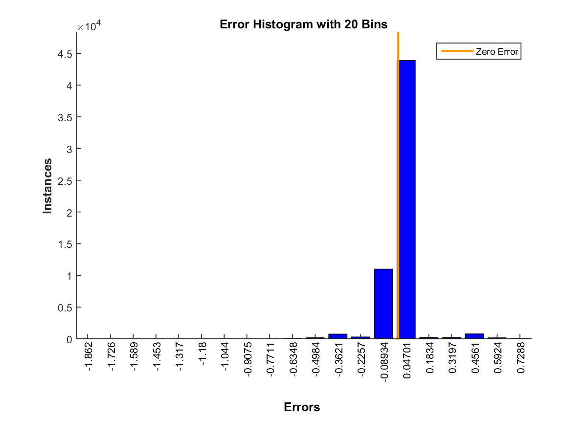
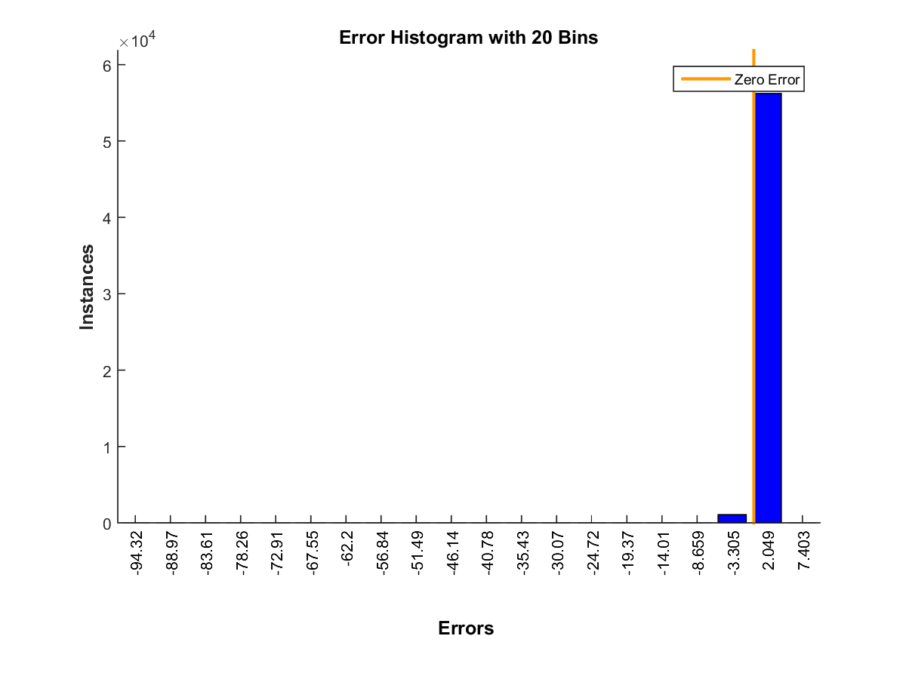
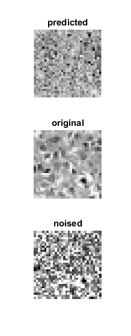
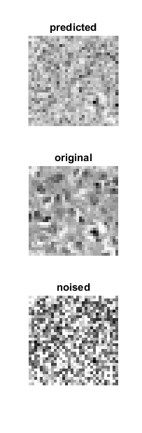
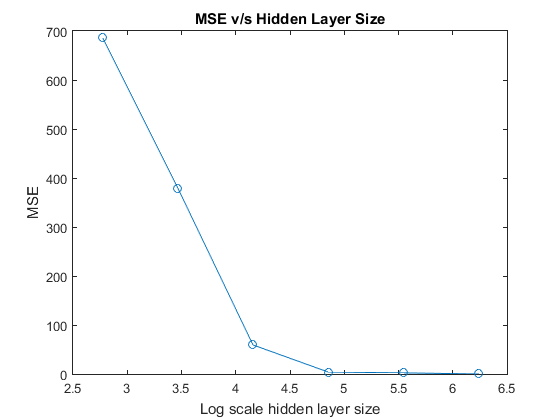
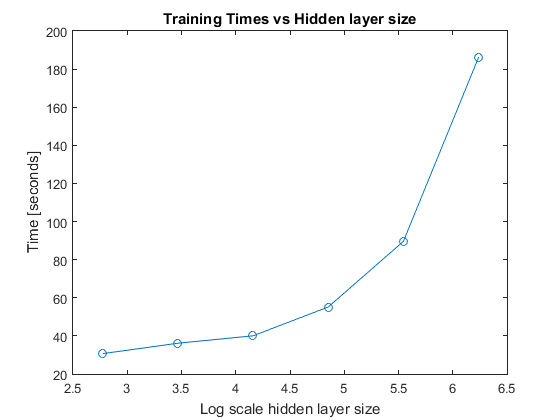
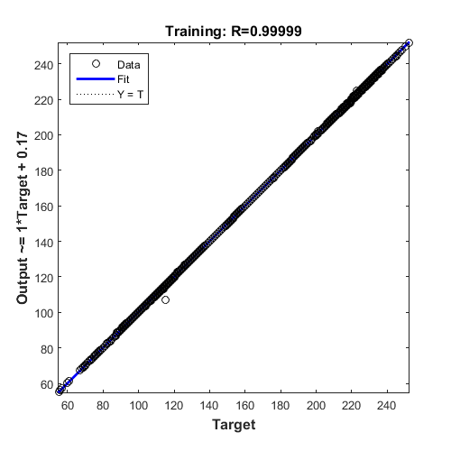

# SYDE 522 Assignment 2
## Autoencoding Histo-pathology images
The images were downloaded from learn and loaded into MATLAB. They were then converted into 32x32 grayscale images. 

Since all these operations were done in MATLAB 2015a, which did not have a default implementation of the autoencoder class, a feedforwardnet was created and configured with a single hidden layer of varying sizes starting at 1024/2, where 1024 = 32x32. The activation functions used in the hidden layer and the output layer was a tangential sigmoid function. The same network resulted in much lower MSE when configured with a 'tansig' as opposed to a 'logsig' activation function. The 'hidden layer size' used in the rest of the report refers to the number of neurons in the single hidden layer of the autoencoder
### Autoencoder with varying hidden layer sizes

#### MSE for hideen layer sizes 512 and 256
The performance(MSE) of this autoencoder is shown in the plot below:

##### Hidden layer size 512

##### Hidden layer size 256

#### Error Histograms for hidden layer sizes 512 and 256
The plot below shows how the error histogram for this network. As is visible in the histograms, most of the errors happened very close to zero.

##### Hidden layer size 512

##### Hidden layer size 256

#### Comparision of network outputs for hidden layer sizes 512 and 256
The outputs were then predicted using the trained network. A comparision between the original image and the image predicted by the network is shown below:. The first set of 2 images compares the results for hidden layer size of 512 while the second set of 2 images is for a hidden layer size of 256. The values of the MSE have increased when the size of the hidden layer was decreased. This makes complete sense as there are lesser weights available to modify the behavior of the hidden layer to match that of the desired targets.

##### Hidden layer size 512

##### Hidden layer size 256

#### MSE vs Hidden layer sizes
The following plot shows the bahvior of the autoencoder's MSE as a function of its hidden layer size. As is visible in the plot, the MSE decreases significantly as the size of the hidden layer increases.

#### Training Times vs Hidden layer sizes
The following plot shows the change in training times as a function of the hidden layer size. Its obvious that the taining time increases as the size of the hidden layer increases and the relationship is exponential.

#### regression fit for hidden layer size = 256

### Denoising Autoencoder with varying hidden layer sizes
Each of the images was modified by adding speckle noise. The noised images were then used to train the same network used above, except that the number of epochs for the training phase was doubled from 600 to 1200. 

#### MSE for hidden layer sizes 512 and 256
The following plots show the variation in MSE with each epoch for networks with the hidden layer sizes of 512 and 256

##### Hidden layer size 512

##### Hidden layer size 256

#### Error Histograms for hideen layer sizes 512 and 256
The plot below shows how the error histogram for this network. As is visible in the histograms, most of the errors happened very close to zero.

##### Hidden layer size 512

##### Hidden layer size 256

#### Comparision of network outputs for hidden layer sizes 512 and 256
The autoencoder performed extremely well at getting rid of the added speckle noise from the input. This confirms the main application of a denoising autoencoder, i.e., letting the network loearn the input from a corrupted version of the input itself results in better predictive ability of the network to puse more robust features to represent the inputs in the hidden layers

#### MSE vs Hidden layer sizes
The plot below shows MSE for both types of encoders trained in this assignment. The denoising autoencoder was trained on a set of noised images and with training targets being the original denoised images. The MSE was calculated on the network's prediction to the denoised input. As is visible, the performance of this denoising autoencoder for smaller hidden layer sizes was a lot better than the normal autoencoder

#### Training Times vs Hidden layer sizes
The plot below shows training times for normal and denoising autoencoder. It is to be noted here that the training times are effectively doubled at each layer size because of the increase in epoch size from 600 to 1200. As is expected, training times are still exponentially dependent on the hidden layer size.

#### regression fit for hidden layer size = 256
This plot shows the performance of the denoising autoencoder at predicting a noiseless input using 256 neurons in the hidden layer

### Conclusion
It seems like denoising autoencoders are very useful for lossy compression and optimization. One kind of autoencoders not evaluated in this assignment are overcomplete autoencoders, in which the hidden layer has more units than the input later. A few researchers have reported that overcomplete networks will tend to yield more useful representations at the hidden layer (use is determined by the amount of classification error). A simple explanation is that stochastic gradient descent with early stopping is similar to an L2 regularization of the parameters. To achieve perfect reconstruction of continuous inputs, a one-hidden layer auto-encoder with non-linear hidden units (exactly like in the above code) needs very small weights in the first (encoding) layer, to bring the non-linearity of the hidden units into their linear regime, and very large weights in the second (decoding) layer. The addition of sparsity instead of noise to the input data is extremely useful in getting the hidden layer to capture the true form of the input layer.