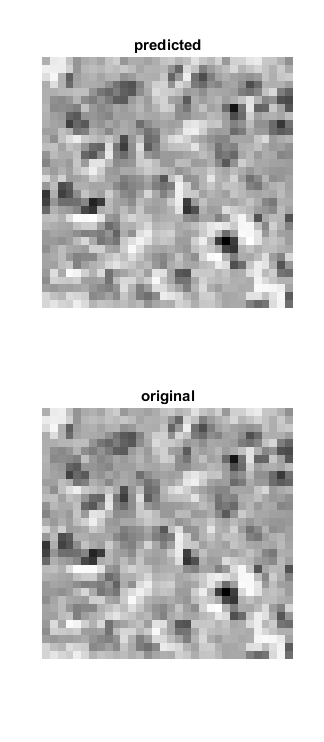
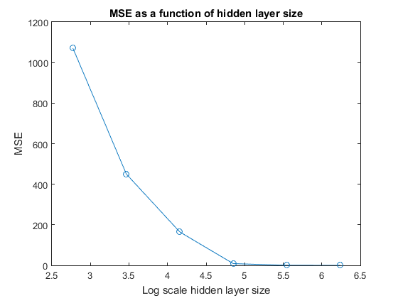
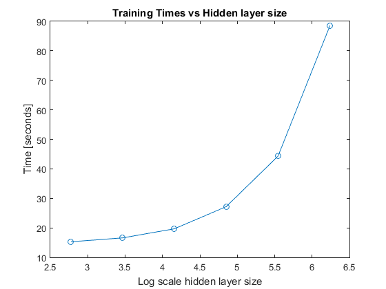

# SYDE 522 Assignment 2
## Autoencoding Histo-pathology images
The images were downloaded from learn and loaded into MATLAB. They were then converted into 32x32 grayscale images. 

Since all these operations were done in MATLAB 2015a, which did not have a default implementation of the autoencoder class, a feedforwardnet was created and configured with a single hidden layer of varying sizes starting at 1024/2, where 1024 = 32x32. The activation functions used in the hidden layer and the output layer was a tangential sigmoid function. The same network resulted in much lower MSE when configured with a 'tansig' as opposed to a 'logsig' activation function.
### Autoencoder with varying hidden layer sizes

#### MSE for hideen layer sizes 512 and 256
The performance(MSE) of this autoencoder is shown in the plot below:

#### Error Histograms for hideen layer sizes 512 and 256
The plot below shows how the error histogram for this network. As is visible in the histograms, most of the errors happened very close to zero.

#### Comparision of network outputs for hideen layer sizes 512 and 256
The outputs were then predicted using the trained network. A comparision between the original image and the image predicted by the network is shown below:. The first set of 2 images compares the results for hidden layer size of 512 while the second set of 2 images is for a hidden layer size of 256. The values of the MSE have increased when the size of the hidden layer was decreased. This makes complete sense as there are lesser weights available to modify the behavior of the hidden layer to match that of the desired targets.

#### MSE vs Hidden layer sizes
The following plot shows the bahvior of the autoencoder's MSE as a function of its hidden layer size. As is visible in the plot, the MSE decreases significantly as the size of the hidden layer size.

#### Training Times vs Hidden layer sizes
The following plot shows the change in training times as a function of the hidden layer size. Its obvious that the taining time increases as the size of the hidden layer increases and the relationship is exponential.

### Denoising Autoencoder with varying hidden layer sizes
Each of the images was modified by adding speckle noise. The noised images were then used to train the same network used above, except that the number of epochs for the training phase was doubled from 600 to 1200. 

#### MSE for hidden layer sizes 512 and 256
